# VSD Advanced Physical Design Worshop with sky130nmPDK and OpenLane


Table of contents
=================

<!--ts-->
   * [Day 1](https://github.com/manjunathrv/VSD_Advanced_Physical_Design_with_sky130nmPDK#day-1)
      * [Introduction to Physical Design flow](https://github.com/manjunathrv/VSD_Advanced_Physical_Design_with_sky130nmPDK#introduction-to-physical-design-flow)
      * [Introduction to Openlane flow](https://github.com/manjunathrv/VSD_Advanced_Physical_Design_with_sky130nmPDK#introduction-to-openlane-flow)
      * [Openlane directory structure](https://github.com/manjunathrv/VSD_Advanced_Physical_Design_with_sky130nmPDK#openlane-directory-structure)
   * [Day 2](https://github.com/manjunathrv/VSD_Advanced_Physical_Design_with_sky130nmPDK#day-2)
      * [Design prepartion and synthesis flow](https://github.com/manjunathrv/VSD_Advanced_Physical_Design_with_sky130nmPDK#design-prepartion-and-synthesis-flow)
      * [Floorplan](https://github.com/manjunathrv/VSD_Advanced_Physical_Design_with_sky130nmPDK#design-prepartion-and-synthesis-flow)
   
   * [Day 3](https://github.com/manjunathrv/VSD_Advanced_Physical_Design_with_sky130nmPDK#day-3)
      * [IO placement modification](https://github.com/manjunathrv/VSD_Advanced_Physical_Design_with_sky130nmPDK#vsd-cmos-inverter-cell)
      * [VSD CMOS Inverter Cell](https://github.com/manjunathrv/VSD_Advanced_Physical_Design_with_sky130nmPDK#vsd-cmos-inverter-cell)
      * [Spice simulation of the VSD CMOS Inverter Cell](https://github.com/manjunathrv/VSD_Advanced_Physical_Design_with_sky130nmPDK#spice-simulation-of-the-vsd-cmos-inverter-cell)
   	
   * [Day 4](https://github.com/manjunathrv/VSD_Advanced_Physical_Design_with_sky130nmPDK#day-4)
      * [Verification of Gate level Synthesized (GLS) netlist ](https://github.com/manjunathrv/VSD_RTL_Design_using_sky130nmPDK_workshop#1-verification-of-gate-level-synthesized-gls-netlist-)
      * [Lab Session 1 GLS Synthesis simulation mismatch](https://github.com/manjunathrv/VSD_RTL_Design_using_sky130nmPDK_workshop#2-lab-1-gls-synthesis-simulation-mismatch-)
 
   * [Day 5](https://github.com/manjunathrv/VSD_Advanced_Physical_Design_with_sky130nmPDK#day-5)
      * [If - Else statement](https://github.com/manjunathrv/VSD_RTL_Design_using_sky130nmPDK_workshop#1-if---else-statement)
      * [Case structure](https://github.com/manjunathrv/VSD_RTL_Design_using_sky130nmPDK_workshop#2-case-structure)
      * [Lab Session 1 Incomplete If-Else statement](https://github.com/manjunathrv/VSD_RTL_Design_using_sky130nmPDK_workshop#4-lab-session-1-incomplete-if-else-statement)
      * [Lab Session 2 Incomplete Case statement](https://github.com/manjunathrv/VSD_RTL_Design_using_sky130nmPDK_workshop#4-lab-session-2-incomplete-case-statement)
   * [Acknowledgement](https://github.com/manjunathrv/VSD_RTL_Design_using_sky130nmPDK_workshop#acknowledgement)

<!--te-->

# Day 1 

## Introduction to Physical Design flow
The physical design flow in ASIC development process is shown in the below figure, <br/> 

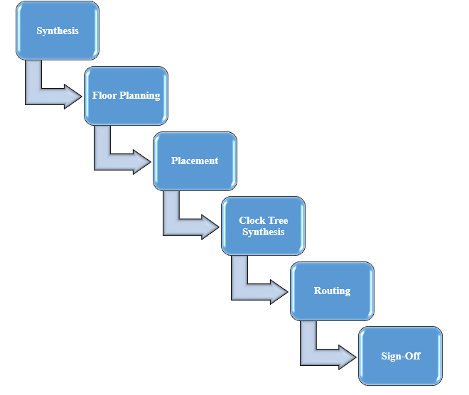 <br/> 

A brief description of each step is given in the below points, 
1. Synthesis - In this step the RTL design is converted into gate level netlist. 
2. Floorplan - The planning of the macros and the power distribution network on the given silicon area are done.
3. Placement - The standard cells are placed on the rows of the floorplan. 
4. Clock tree synthesis - The clock network is defined in the chip. The network is optimisied to enable reduction in skew across the chip. 
5. Routing - The interconnects between the cells in the chip are done. 
6. Sign-off - The logical and physical verification of the layout are done in this step before generation of the GDSII file for tape out.


## Introduction to Openlane flow
OpenLANE is a set of tools to enable all the functionalities from RTL to GDS II in the ASIC development process. <br/> 
The set of tools used for each steps are described in the below figure, <br/> 

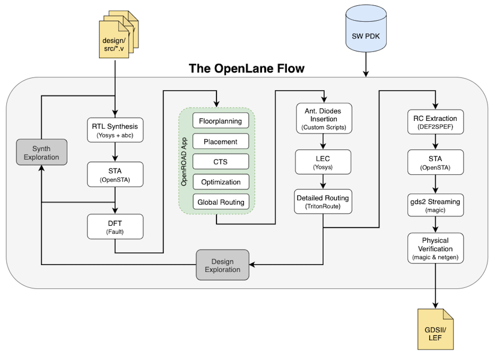 <br/> 

## Openlane directory structure

In this workshop, the necessary tools are installed in the server by following the steps in the link : https://github.com/The-OpenROAD-Project/OpenLane <br/> 

The directories present in openlane_working directory are openlane and PDKS <br/> 

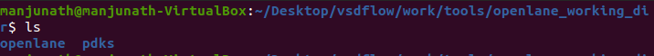 <br/>

The PDKs that are present in this folder are skywater-pdk(foundry PDK), sky130A(Open-source PDK).  

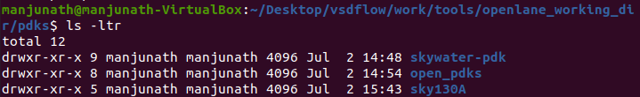 <br/>

The technology library files are present in libs.tech folder. 

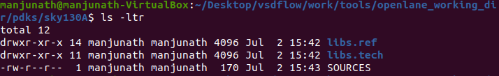 <br/>

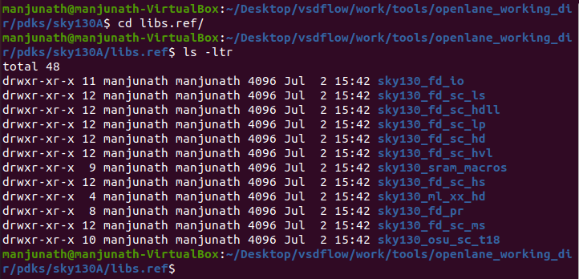 <br/>

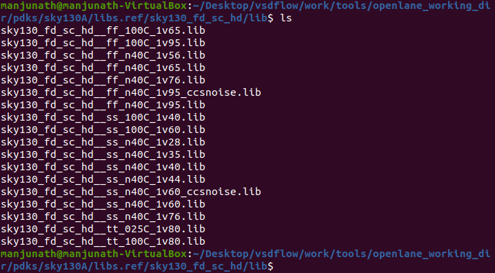 <br/>


# Day 2

## Design prepartion and synthesis flow
In this workshop, the project picorv32a is used as an example to learn the complete RTL to GDSII flow.<br/>
The project picorv32a is found in the design folder. <br/>
The folder structure consists of source folder(src) - having the verilog file and sdc file, configuration file (config.tcl) and results folder(runs) <br/>

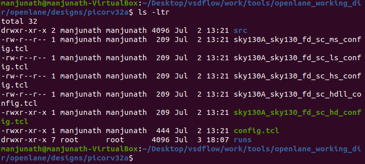 <br/>

The configuration file consists of various environment variables and paths to source files.<br/>

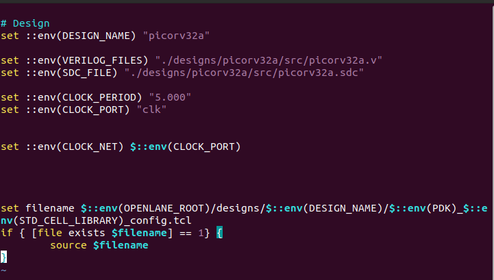 <br/>

OpenLane is started by invoking the following commands - First run docker and open OpenLane

```console
make mount
./flow.tcl -interactive
```

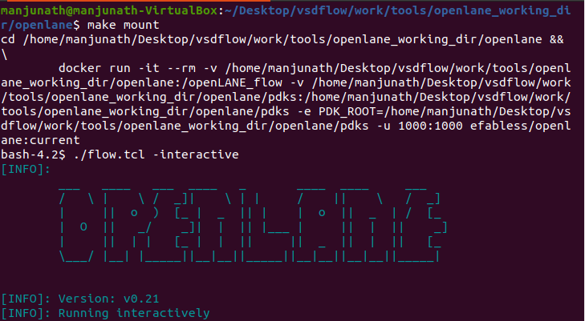 <br/>

The OpenLane shell is started. Next the design of the picorv32a project is prepared by using the following commands. <br/>

```console
%prep -design picorv32a
```
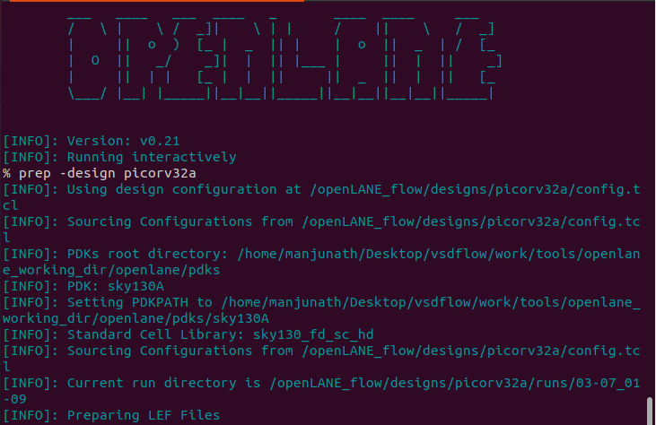 <br/>

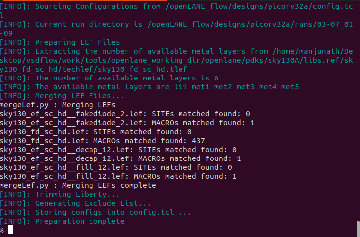 <br/>

Next the synthesis step is done to generate the gate-level netlist. This script invokes yosys and ABC. 

```console
%run_synthesis
```
 <br/>

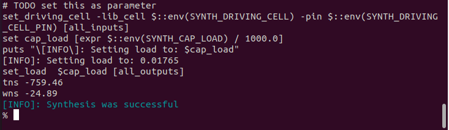 <br/>

From the statistics report, the D-flip flop ratio is calculated to be 8.9%

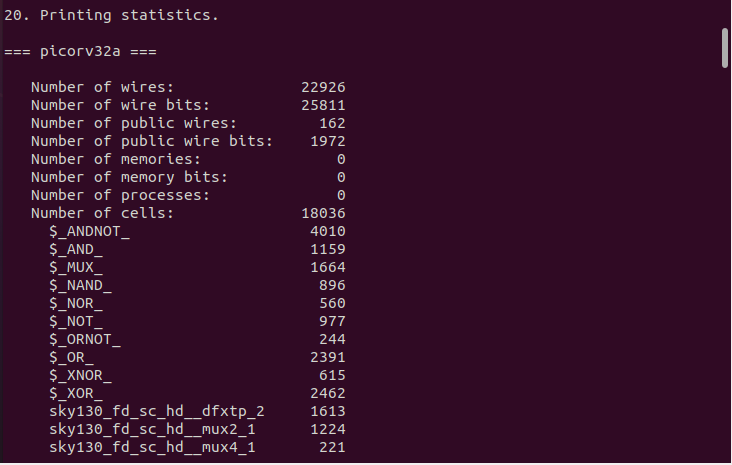 <br/>

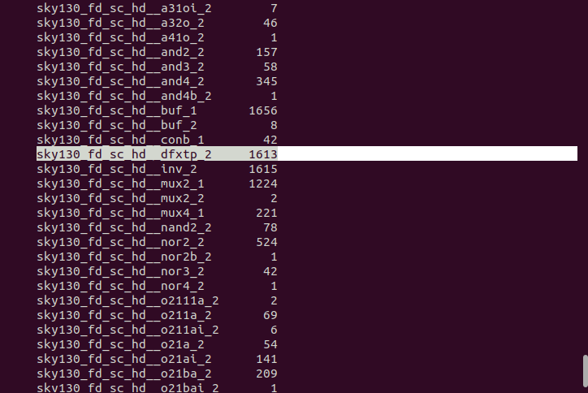 <br/>

## Floorplan

Next, the floorplan of the picorv32a is done by executing the following command. <br/>

```console
%run_floorplan
```
The layout after floorplan is checked in Magic layout editor as shown below, 

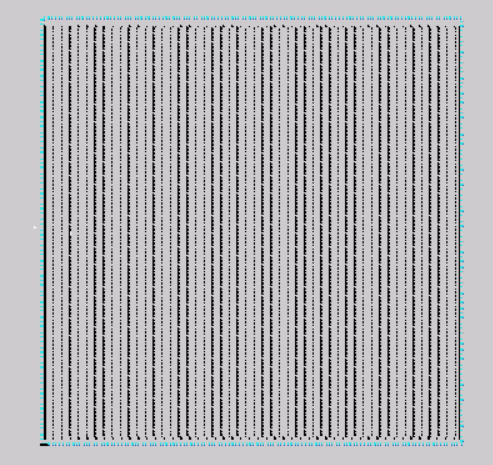 <br/>

Some of the cells that we see in the layout are decap cells, tap cells and the macro cells. <br/>

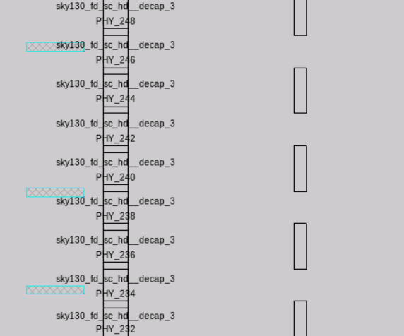 <br/>

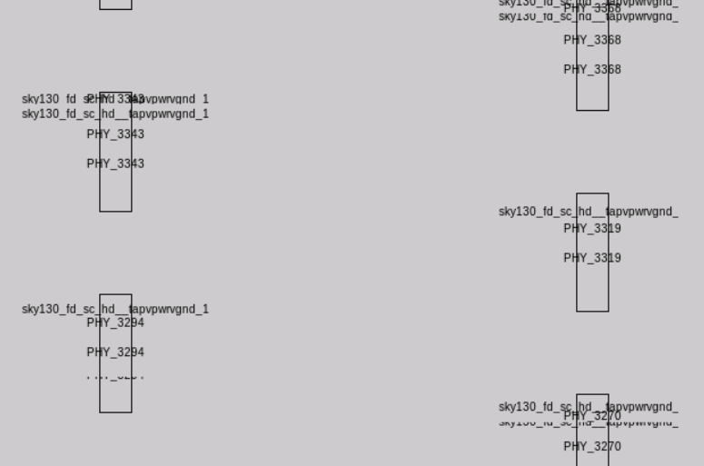 <br/>

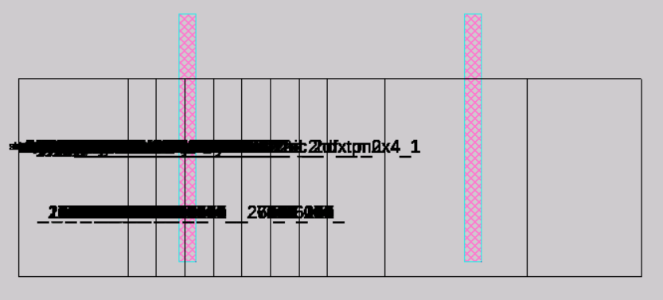 <br/>

# Day 3 

## IO placement modification. 
In this step, the changes in the environment variables for IO placement are observed. <br/>
The IO pins are placed at equidistance by setting the enviroment variable FP_IO_mode as 1 in the configuration file. <br/>
The IO pins that are blue in colour across the chip are shown in the below figure,<br/>

 <br/>

Inorder to have the IO pins at non-equidistance the environment variable FP_IO_mode is set to 2 and the output obtained is seen in Magic as shown below,  <br/>

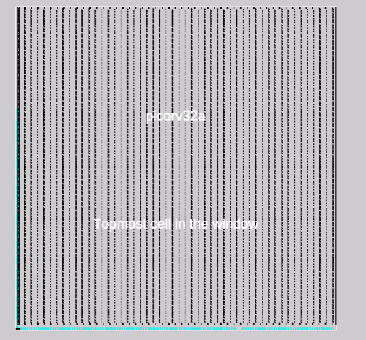 <br/>

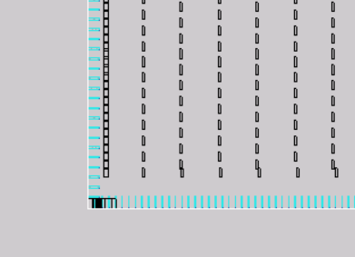 <br/>


## VSD CMOS Inverter Cell

A schematic of a CMOS inverter is shown in the below figure. <br/> 
 <br/> 
<br/> 
The input to the CMOS inverter is labelled as A and the output is Y.<br/>

The VSD CMOS inverter cell for the lab is taken from the github link <br/>

The CMOS inverter is checked in Magic layout editor using the following commands. <br/>

The image in Magic Layout editor can be centered by pressing v and the top cell is shown by pressing s.<br/> 

The output obtained is shown below.<br/> 

 <br/> 
<br/> 
<br/> 
The layer of N-well in the PMOS region can be found by moving the cursor close to the large box surrounding the PMOS layer and typing the command what in the tkon console window as shown below, <br/> 

 <br/> 

Similarly, NMOS, PMOS and poly layers of the inverter are found as shown below, <br/> 

<strong>NMOS</strong> <br/> 

 <br/> 

<strong>PMOS</strong>

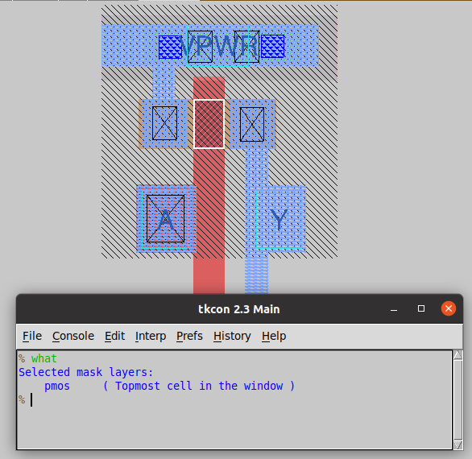 <br/> 
 
 <strong>poly</strong> 
 
 <br/> 

## Spice simulation of the VSD CMOS Inverter Cell
### Static simulation of the CMOS Inverter

The circuit for the static simulation of the CMOS inverter is shown below, <br/> 

 <br/> 

The typical voltage transfer characteristices for the static simulation of the CMOS inverter is shown below, <br/> 


### Dynamic simulation of the CMOS Inverter

The spice netlist obtained from magic tool is done by using the commands extract all, ext2spice thresh 0 rthresh 0, ext2spice as shown below, <br/> 

 <br/> 

The output spice netlist from the CMOS inverter layout is shown below, <br/> 

 <br/> 

For dynamic simulation, the netlist is modified as below, <br/>
 <br/> 

Next, the spice simulation is done in ngspice by the following commands.<br/> 

 <br/> 

 <br/> 

The output waveform of the VSD CMOS inverter is shown below, <br/> 

 <br/> 

From the CMOS Output waverform, the calculation of rise slew time taken to go from 20% to 80% of the Vout(y) as shown below,  <br/> 
 <br/> 

 <br/> 

The rise slew time obtained is ps  <br/> 

Similarly, the falling slew time is obtained with the time taken to go from 20% to 80% of the Vout(y) as shown below as shown below,  <br/> 
 <br/> 

 <br/> 

The fall slew time obtained is ps  <br/> 

In the next step, the rise time and the fall time is calculated. <br/>
The rise taken with the midpoint of the Vin(a) and Vout(y) <br/> 
 <br/> 
 <br/> 
The fall slew time obtained is ps  <br/>

The fall taken with the midpoint of the Vin(a) and Vout(y) <br/> 
 <br/> 
 <br/> 
The fall slew time obtained is ps  <br/>

# Day 4 

## Introduction to Physical Design flow
## Introduction to Openlane flow
## Openlane directory structure
## Design prepartion and synthesis flow

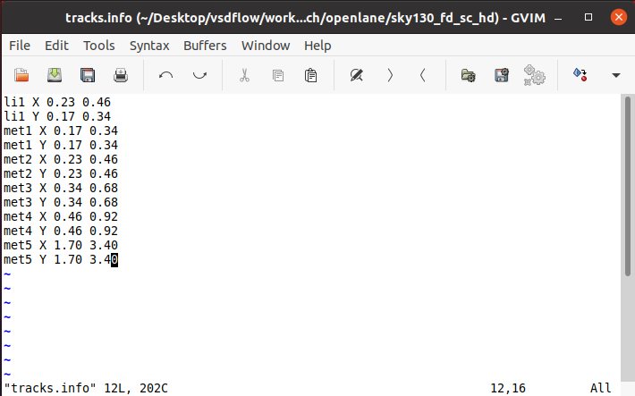 <br/> 

 <br/> 

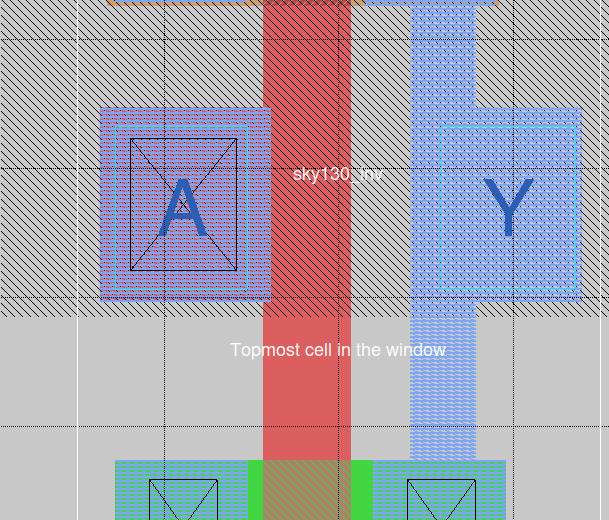 <br/> 

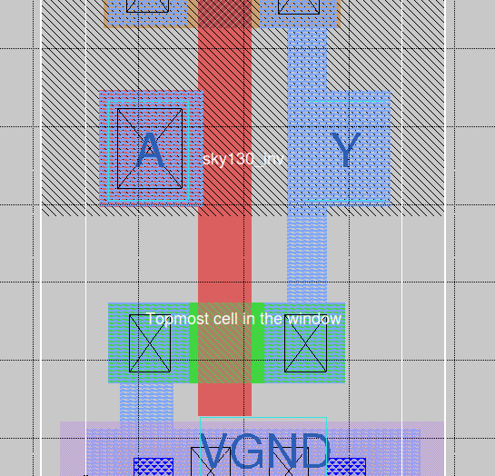 <br/> 

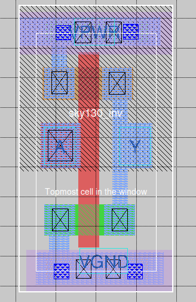 <br/> 

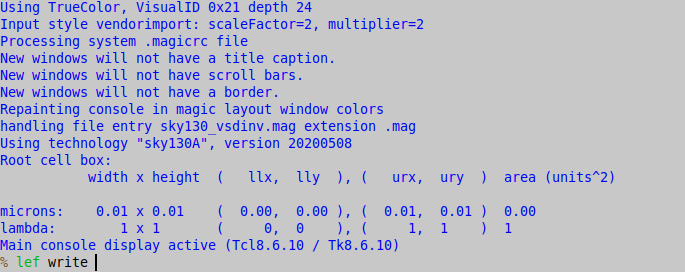 <br/> 

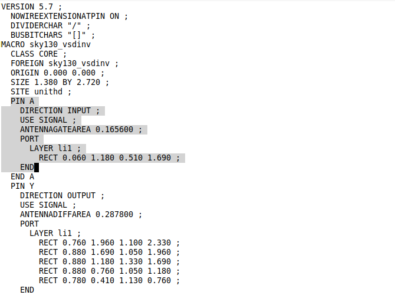 <br/> 

 <br/> 

 <br/> 

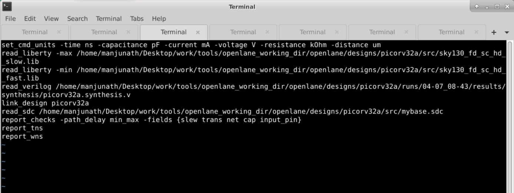 <br/> 

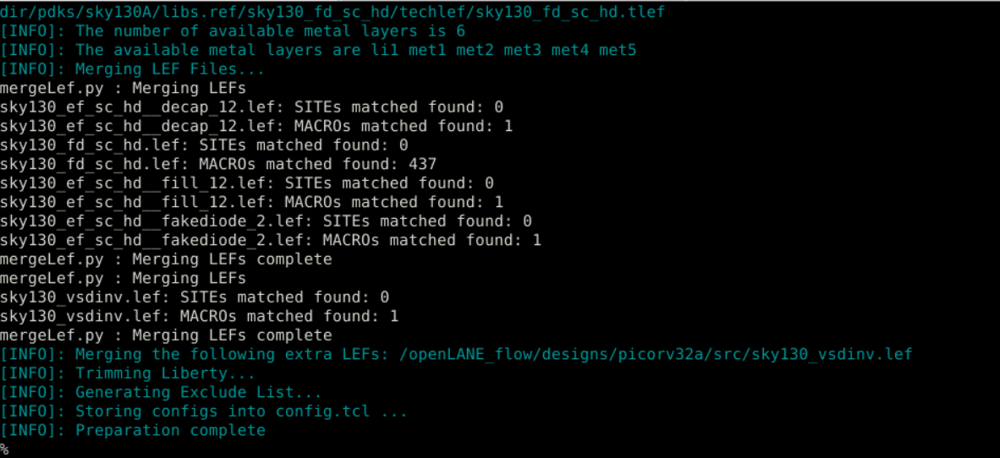 <br/> 

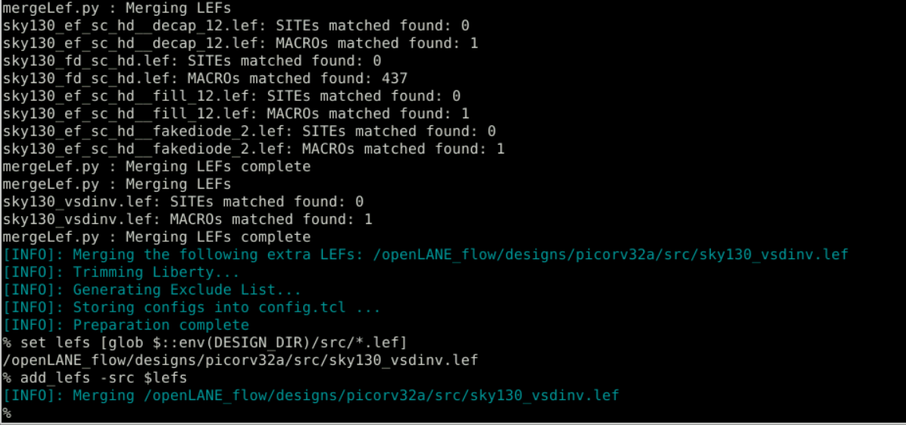 <br/> 

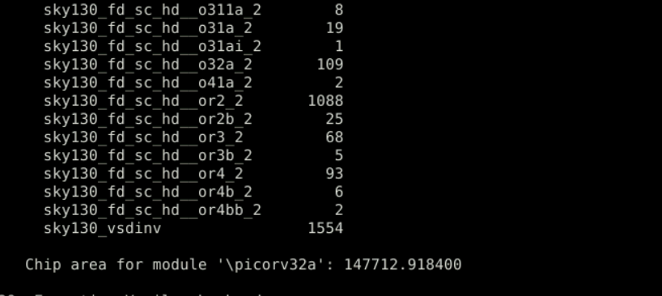 <br/> 

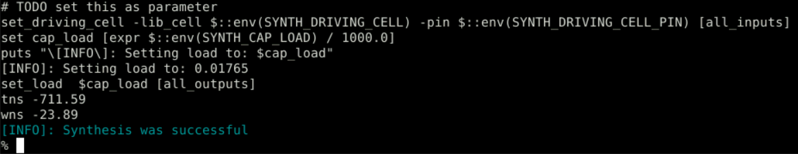 <br/> 

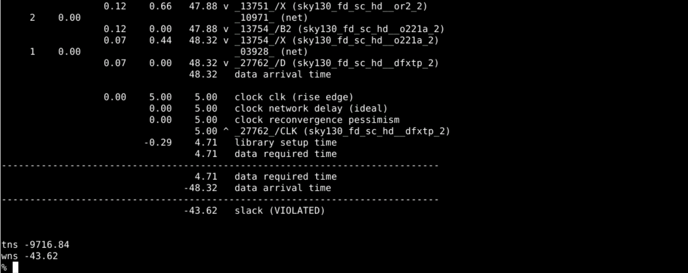 <br/> 

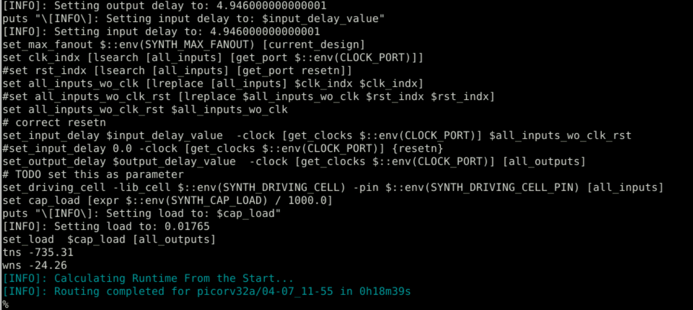 <br/> 

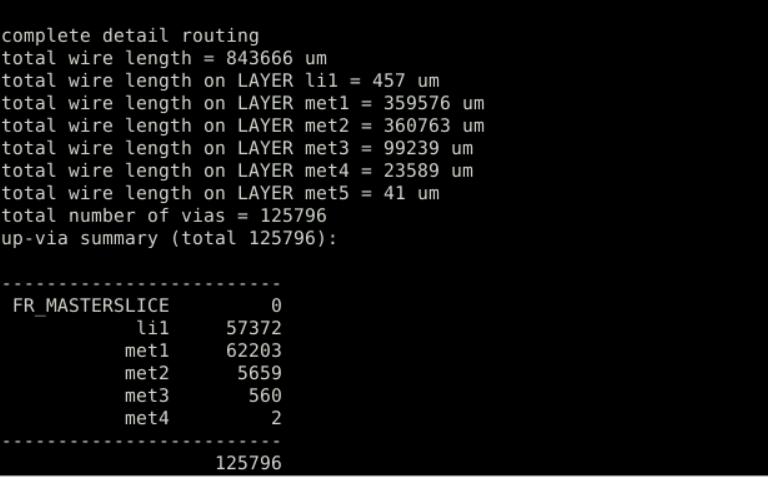 <br/> 

 <br/> 

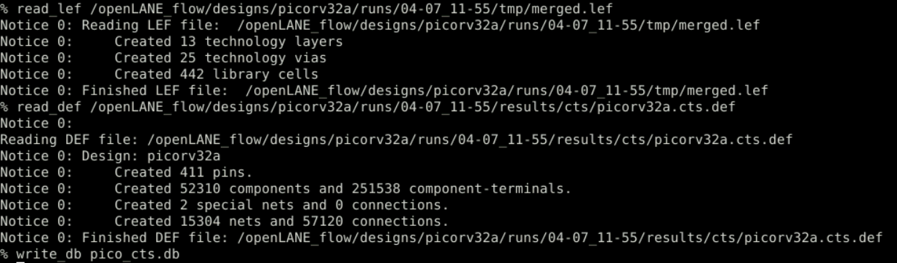 <br/> 

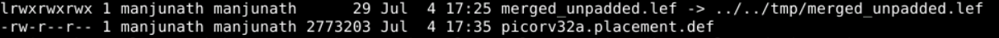 <br/> 

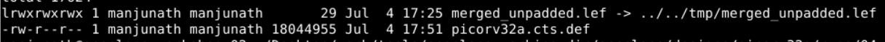 <br/> 


# Day 5 

## Floorplan

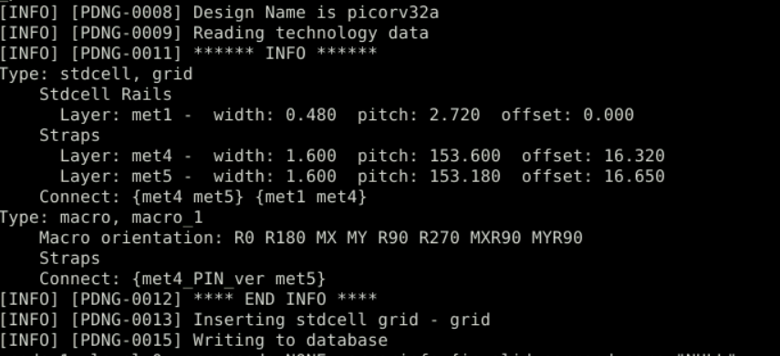 <br/> 

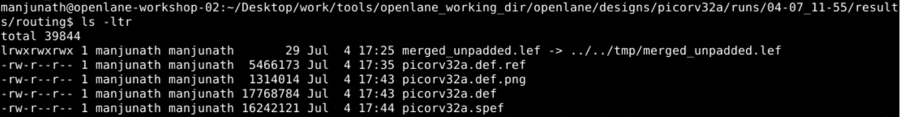 <br/> 

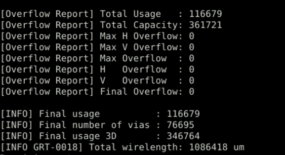 <br/> 

 <br/>

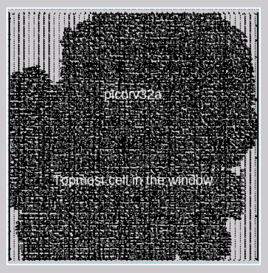 <br/>

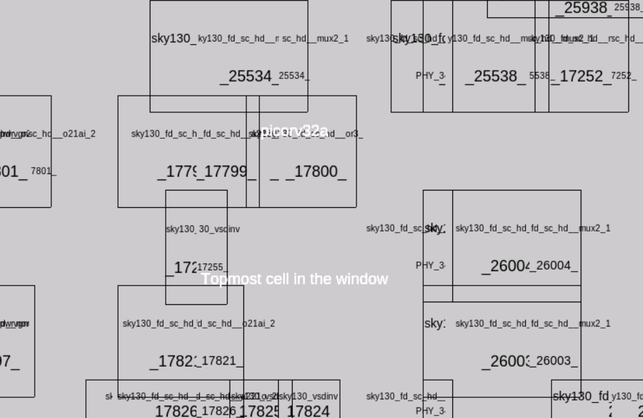 <br/>

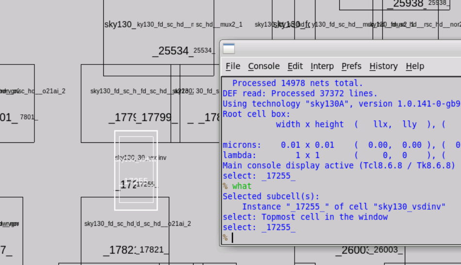 <br/>

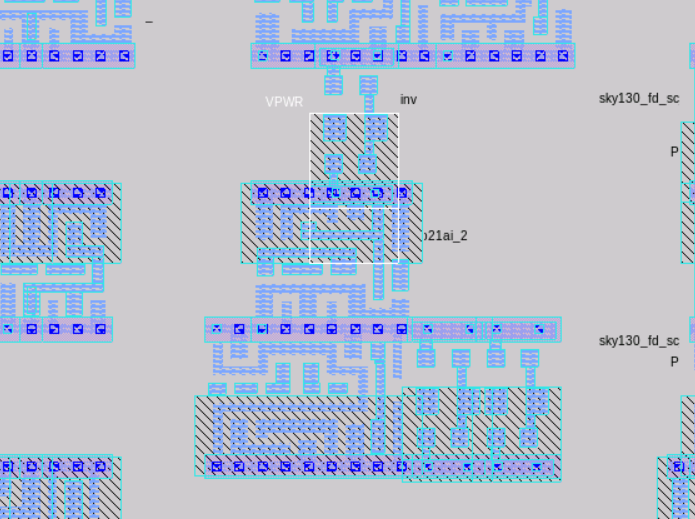 <br/>

## Placement

 <br/>

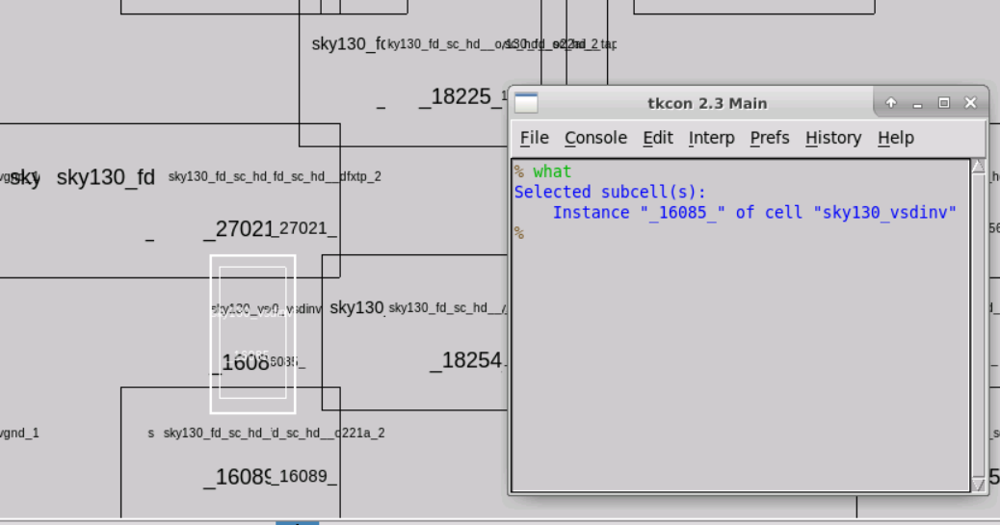 <br/>

 <br/>

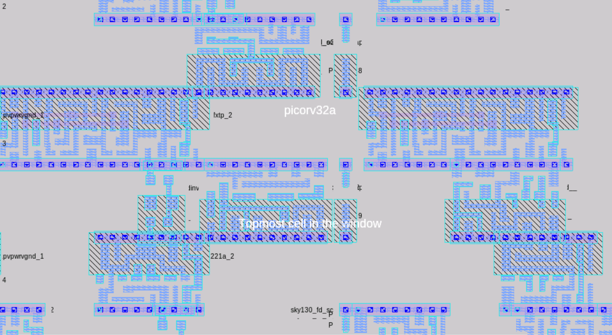 <br/>

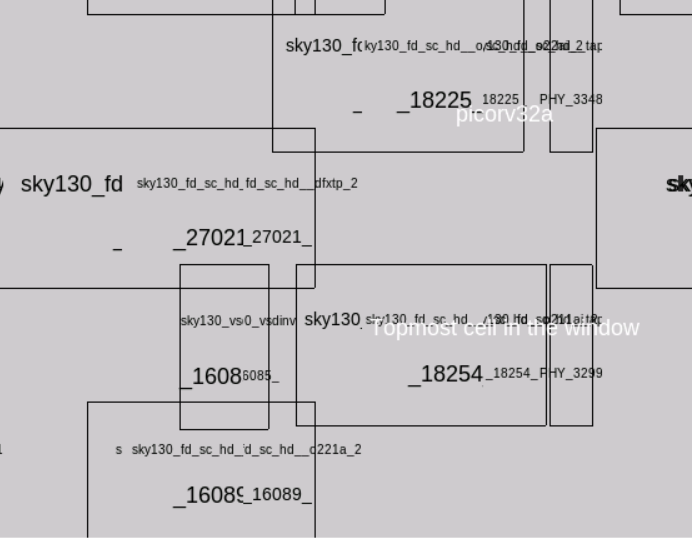 <br/>

## Routing

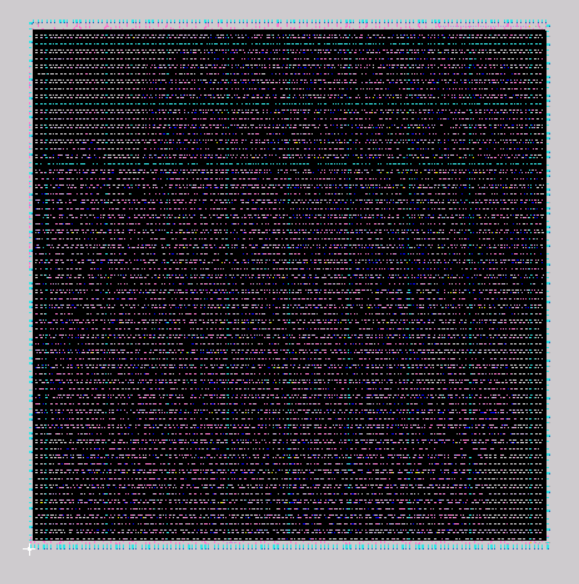 <br/>

 <br/>

 <br/>

 <br/>

 <br/>


