# VSD Advanced Physical Design Worshop with sky130nmPDK and OpenLane

Table of contents
=================

<!--ts-->
   * [Day 1](https://github.com/manjunathrv/VSD_RTL_Design_using_sky130nmPDK_workshop#day-1)
      * [Introduction to Physical Design flow](https://github.com/manjunathrv/VSD_RTL_Design_using_sky130nmPDK_workshop#introduction-to-open-source-eda-tools---iverilog-gtkwave-and-yosys)
      * [Introduction to Openlane flow](https://github.com/manjunathrv/VSD_RTL_Design_using_sky130nmPDK_workshop#introduction-to-open-source-eda-tools---iverilog-gtkwave-and-yosys)
      * [Openlane directory structure](https://github.com/manjunathrv/VSD_RTL_Design_using_sky130nmPDK_workshop#introduction-to-open-source-eda-tools---iverilog-gtkwave-and-yosys)
      * [Design prepartion and synthesis flow](https://github.com/manjunathrv/VSD_RTL_Design_using_sky130nmPDK_workshop#introduction-to-open-source-eda-tools---iverilog-gtkwave-and-yosys)
   * [Day 2](https://github.com/manjunathrv/VSD_RTL_Design_using_sky130nmPDK_workshop#day-2)
      * [Introduction to technology library file](https://github.com/manjunathrv/VSD_RTL_Design_using_sky130nmPDK_workshop#1-introduction-to-technology-library-file)
      * [Lab Session 1 - Hierachal and Flatten synthesis](https://github.com/manjunathrv/VSD_RTL_Design_using_sky130nmPDK_workshop#2-lab-session-1---hierachal-and-flatten-synthesis)
      * [Lab Session 2 - Flip-Flop implementation and synthesis](https://github.com/manjunathrv/VSD_RTL_Design_using_sky130nmPDK_workshop#3-lab-session-2---flip-flop-implementation-and-synthesis)
    
   * [Day 3](https://github.com/manjunathrv/VSD_RTL_Design_using_sky130nmPDK_workshop#day-3)
      * [VSD CMOS Inverter Cell](https://github.com/manjunathrv/VSD_RTL_Design_using_sky130nmPDK_workshop#1-introduction-to-optimisation-)
      * [Spice simulation of the VSD CMOS Inverter Cell](https://github.com/manjunathrv/VSD_Advanced_Physical_Design_with_sky130nmPDK#spice-simulation-of-the-vsd-cmos-inverter-cell)

   	
   * [Day 4](https://github.com/manjunathrv/VSD_RTL_Design_using_sky130nmPDK_workshop#day-4)
      * [Verification of Gate level Synthesized (GLS) netlist ](https://github.com/manjunathrv/VSD_RTL_Design_using_sky130nmPDK_workshop#1-verification-of-gate-level-synthesized-gls-netlist-)
      * [Lab Session 1 GLS Synthesis simulation mismatch](https://github.com/manjunathrv/VSD_RTL_Design_using_sky130nmPDK_workshop#2-lab-1-gls-synthesis-simulation-mismatch-)
 
   * [Day 5](https://github.com/manjunathrv/VSD_RTL_Design_using_sky130nmPDK_workshop#day-5)
      * [If - Else statement](https://github.com/manjunathrv/VSD_RTL_Design_using_sky130nmPDK_workshop#1-if---else-statement)
      * [Case structure](https://github.com/manjunathrv/VSD_RTL_Design_using_sky130nmPDK_workshop#2-case-structure)
      * [Lab Session 1 Incomplete If-Else statement](https://github.com/manjunathrv/VSD_RTL_Design_using_sky130nmPDK_workshop#4-lab-session-1-incomplete-if-else-statement)
      * [Lab Session 2 Incomplete Case statement](https://github.com/manjunathrv/VSD_RTL_Design_using_sky130nmPDK_workshop#4-lab-session-2-incomplete-case-statement)
   * [Acknowledgement](https://github.com/manjunathrv/VSD_RTL_Design_using_sky130nmPDK_workshop#acknowledgement)

<!--te-->

# Day 1 

## Introduction to Physical Design flow
## Introduction to Openlane flow
## Openlane directory structure
## Design prepartion and synthesis flow

# Day 2

## Introduction to Physical Design flow
## Introduction to Openlane flow
## Openlane directory structure
## Design prepartion and synthesis flow

# Day 3 

## VSD CMOS Inverter Cell

A schematic of a CMOS inverter is shown in the below figure.   
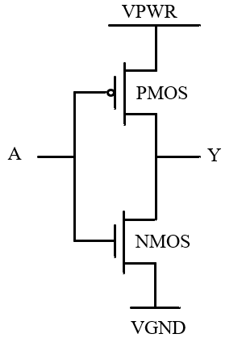   
  
The input to the CMOS inverter is labelled as A and the output is Y. 

The VSD CMOS inverter cell for the lab is taken from the github link  

The CMOS inverter is checked in Magic layout editor using the following commands.  

The image in Magic Layout editor can be centered by pressing v and the top cell is shown by pressing s.  

The output obtained is shown below.  

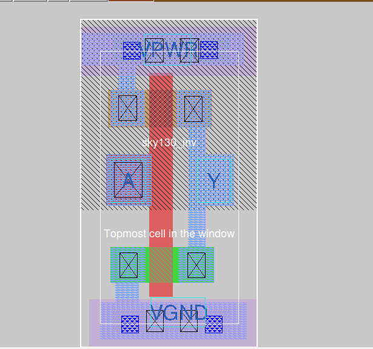   
  
  
The layer of N-well in the PMOS region can be found by moving the cursor close to the large box surrounding the PMOS layer and typing the command what in the tkon console window as shown below,   

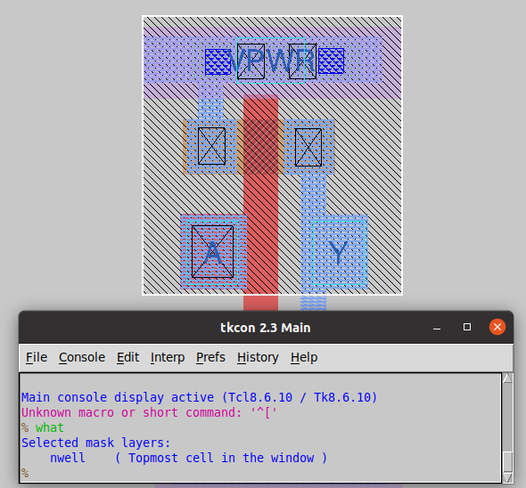   

Similarly, NMOS, PMOS and poly layers of the inverter are found as shown below,   

<strong>NMOS</strong>   

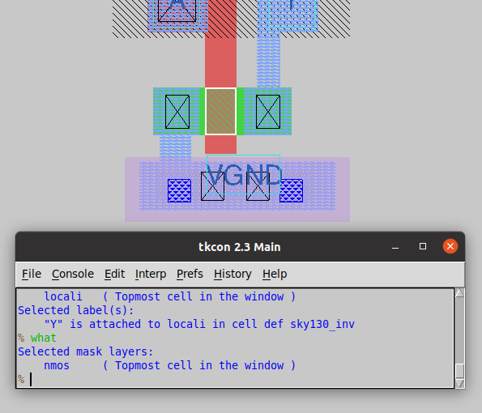   

<strong>PMOS</strong>

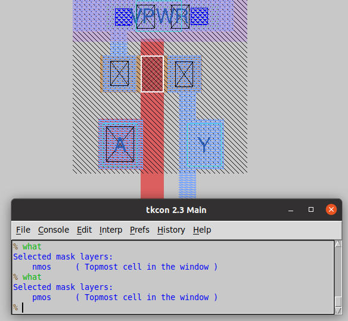   
 
 <strong>poly</strong> 
 
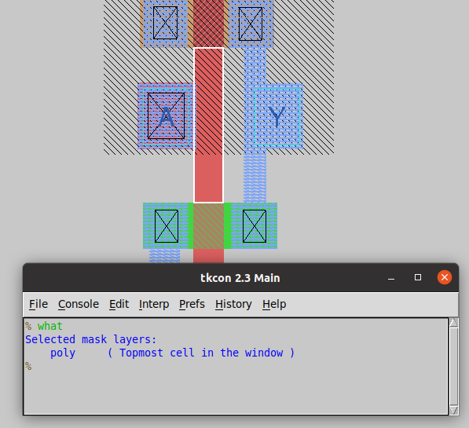   

## Spice simulation of the VSD CMOS Inverter Cell
### Static simulation of the CMOS Inverter

The circuit for the static simulation of the CMOS inverter is shown below,   

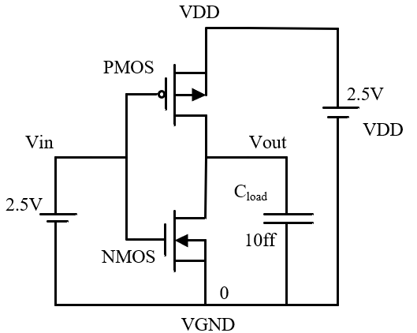   

The typical voltage transfer characteristices for the static simulation of the CMOS inverter is shown below,   

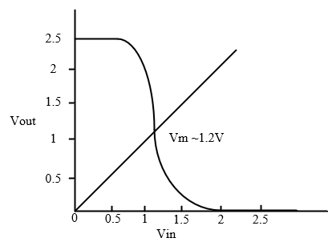

### Dynamic simulation of the CMOS Inverter

The circuit for the dynamic simulation of the CMOS inverter is shown below,   

   

The spice netlist obtained from magic tool is done by using the commands extract all, ext2spice thresh 0 rthresh 0, ext2spice as shown below,   

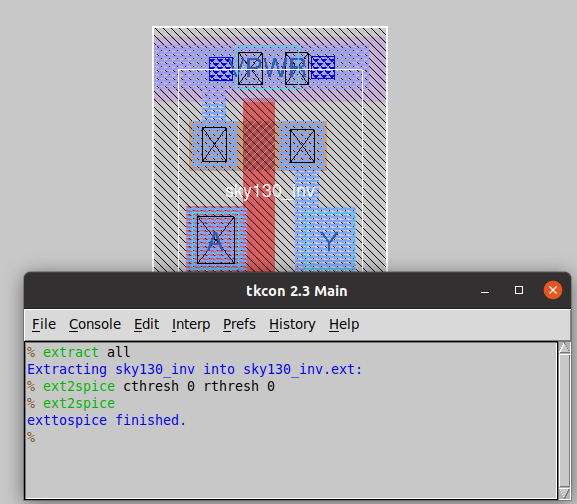   

The output spice netlist from the CMOS inverter layout is shown below,   

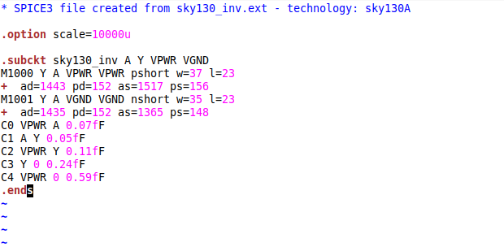   

For dynamic simulation, the netlist is modified as below,  
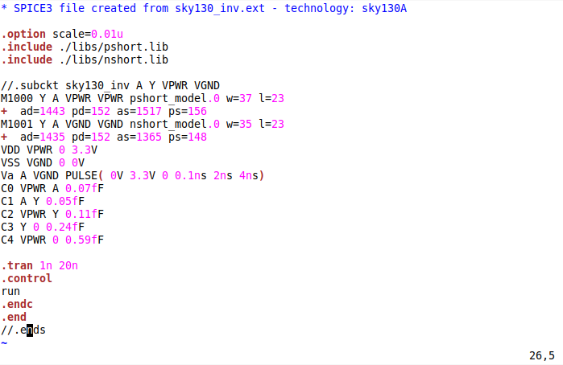   

Next, the spice simulation is done in ngspice by the following commands.  

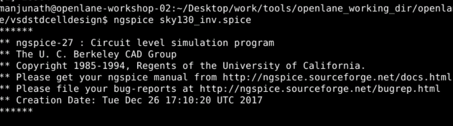   

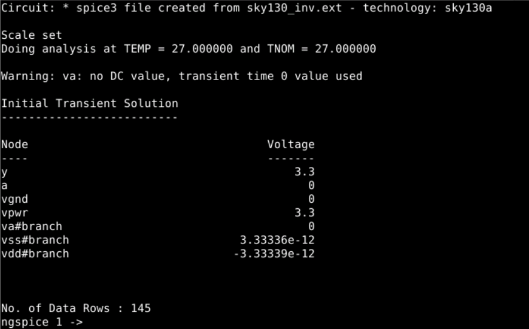   

The output waveform of the VSD CMOS inverter is shown below,   

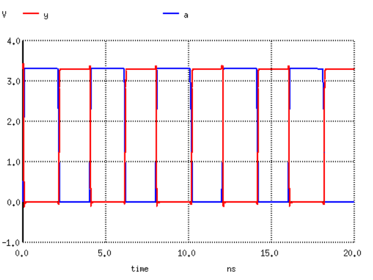   

From the CMOS Output waverform, the calculation of rise slew time taken to go from 20% to 80% of the Vout(y) as shown below,    
   

   

The rise slew time obtained is ps    

Similarly, the falling slew time is obtained with the time taken to go from 20% to 80% of the Vout(y) as shown below as shown below,    
   

   

The fall slew time obtained is ps    

In the next step, the rise time and the fall time is calculated.  
The rise taken with the midpoint of the Vin(a) and Vout(y)   
   
   
The fall slew time obtained is ps   

The fall taken with the midpoint of the Vin(a) and Vout(y)   
   
   
The fall slew time obtained is ps   

## Introduction to Openlane flow
## Openlane directory structure
## Design prepartion and synthesis flow

# Day 4 

## Introduction to Physical Design flow
## Introduction to Openlane flow
## Openlane directory structure
## Design prepartion and synthesis flow

# Day 5 

## Introduction to Physical Design flow
## Introduction to Openlane flow
## Openlane directory structure
## Design prepartion and synthesis flow

